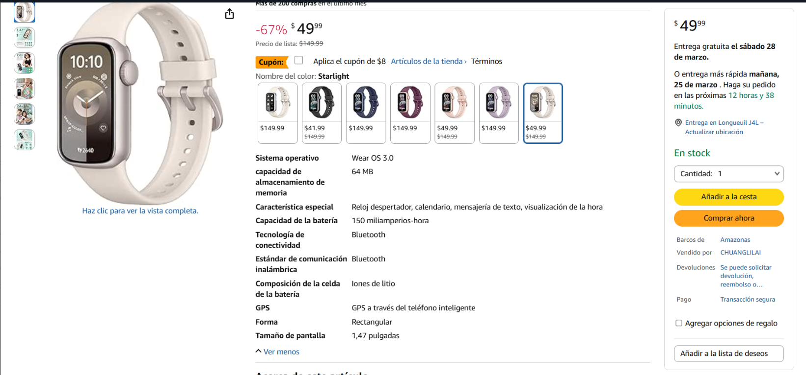
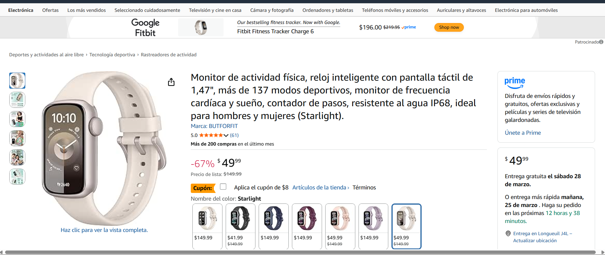
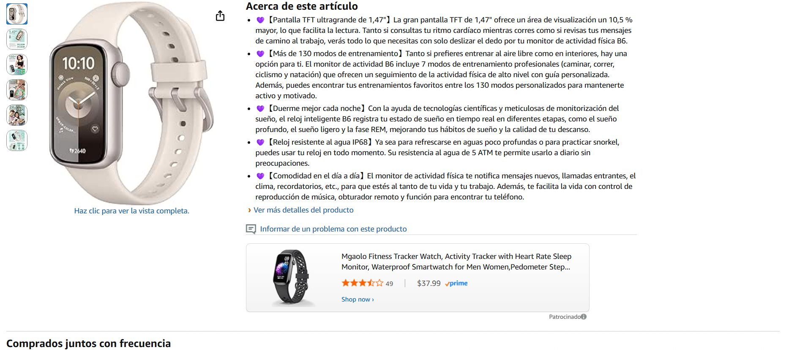

# UX + Bug Showcase – Online Store

## Overview
This project is a visual QA and UX showcase focused on analyzing the shopping experience of a well-known online store. The goal is to identify usability issues, possible bugs, friction points, and improvement opportunities through real screenshots and structured findings.

## Store Analyzed
Amazon

## Project Goal
To build a visually engaging QA and UX portfolio project by reviewing a real online shopping experience and documenting practical findings.

## Scope
The project evaluates the following user flow:
- Homepage navigation
- Product search
- Product listing review
- Product detail page
- Shopping experience friction points
- Visual clarity and usability issues

## Key Findings
## Visual Evidence

### Product page information overload

### Product title too long

### About this item scanability

### Finding 01 – Product page presents excessive information density
The product page contains too much information competing for the user's attention, making it harder to identify essential purchase details quickly.

### Finding 02 – Product title is too long and reduces scanability
The title includes too many attributes in a single block, which reduces first-glance clarity and slows down product understanding.

### Finding 03 – Key product benefits are not easy to scan quickly
The “About this item” section presents long descriptive bullet points, making it harder to recognize the most important benefits in seconds.

## Deliverables
- Visual findings
- UX observations
- Possible bugs or pseudo-bugs
- Improvement ideas
- Screenshot evidence
- Summary report

## Why This Project Matters
This project combines QA thinking with UX analysis in a visual and recruiter-friendly format. It is designed to show not only what is wrong, but also why it matters for the user and how it could be improved.

## Repository Structure
- `findings/` → documented visual findings
- `screenshots/` → screenshot evidence
- `redesign-proposals/` → improvement ideas and suggestions
- `summary-report.md` → final summary of findings

## Skills Demonstrated
- Manual testing
- UX analysis
- Functional analysis
- Visual documentation
- Bug identification
- Structured reporting
- Critical thinking

## Status
In progress
